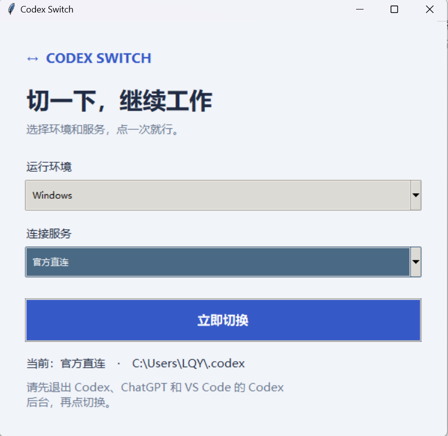
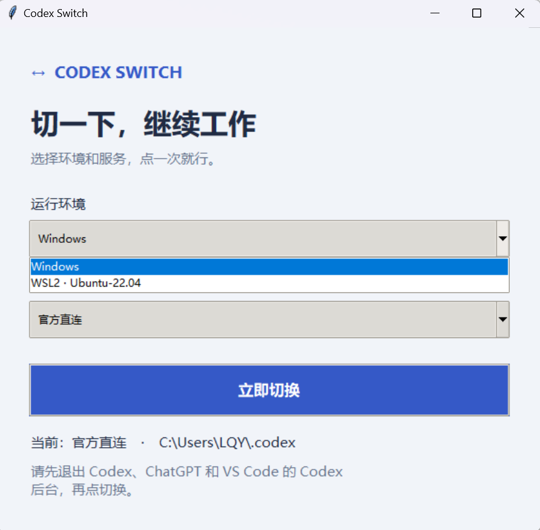
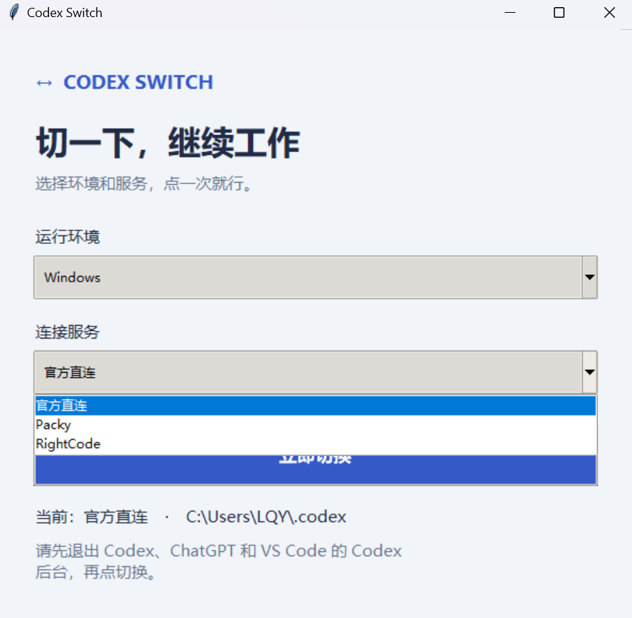

# Codex Switch

> 在 Windows 与 WSL2 中，一键切换 Codex 官方直连、Packy 和 RightCode，同时保留当前环境里的项目、记忆与本地对话。


<p align="center">
  
</p>

## 为什么需要 Codex Switch

你是否遇到过 Codex 官方额度不足，需要临时切换到中转服务的情况？

你是否同时使用官方账号、Packy、RightCode，却每次都要手动修改 `config.toml` 和 `auth.json`，还要反复检查地址、模型和 API Key？

你是否在切换以后发现，原来的对话打不开了，Memory、Project 或本地历史出现错乱，甚至明明选择了新服务，请求却仍然发往旧地址？

如果你还同时使用 Windows 和 WSL2，这件事会更麻烦：两个环境拥有各自独立的 Codex 配置和数据目录，很容易改错位置。

Codex Switch 就是为了解决这个小而频繁的问题。选择运行环境，选择连接服务，点击一次按钮即可完成切换。工具会处理对应环境中的连接配置，让旧对话继续使用刚刚选择的服务，同时保留原来的项目、记忆、技能、MCP 和个人规则。

整个界面只有两个选项和一个按钮：**选环境、选服务、立即切换。**

## 支持范围

| 环境 / 入口 | 支持情况 | 说明 |
|---|---:|---|
| Windows Codex 桌面端 | ✅ | 自动切换配置并重新打开 Codex |
| Windows Codex CLI | ✅ | 新进程会读取切换后的配置 |
| Windows VS Code / Cursor 插件 | ⚠️ | 必要时需要重载编辑器窗口 |
| WSL2 Codex CLI | ✅ | 每个 WSL2 发行版使用自己的配置 |
| WSL2 远程插件 | ⚠️ | 需要确保运行的是 WSL 内的 Codex |
| Windows 与 WSL2 之间迁移会话 | ❌ | 两个环境保持独立，不跨环境复制数据 |

目前内置三个连接选项：

- 官方直连
- Packy
- RightCode

## 使用方法

需要 Python 3.10 或更高版本。

克隆项目并完成一次安装：

```powershell
git clone https://github.com/starry913/Codex-Switch.git
Set-Location .\Codex-Switch
powershell -ExecutionPolicy Bypass -File .\setup.ps1
```

安装完成后，双击 `start.cmd` 即可启动。

### 1. 选择运行环境

选择 `Windows`，或者选择工具检测到的 WSL2 发行版。

<p align="center">
  
</p>

### 2. 选择连接服务

选择 `官方直连`、`Packy` 或 `RightCode`。

<p align="center">
  
</p>

### 3. 点击“立即切换”

完成后重新打开的 Codex 会使用刚刚选择的服务。项目、记忆和本地对话会保留在原来的环境中。

第一次使用某个服务时，需要先按照服务商的 Codex 文档完成一次配置并确认可以正常对话。Codex Switch 不附带任何 API Key，凭据只保存在你的本机，不会上传到仓库。

## 许可证与声明

[MIT License](LICENSE)

本项目不是 OpenAI、Packy 或 RightCode 的官方产品，与这些服务商不存在隶属或背书关系。服务地址、模型名称和兼容性可能随服务商调整，请以各自最新文档为准。
