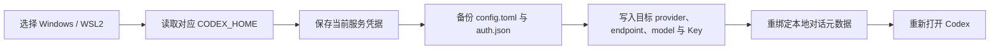

# Codex Switch

> 在 Windows 与 WSL2 中，一键切换 Codex 官方账号、Packy 和 RightCode，同时保留当前环境里的项目、记忆与本地对话。


<p align="center">
  
</p>

Codex Switch 是一个本地连接切换工具。它不提供新的聊天客户端，也不代理你的网络流量；它只在你选择的环境中更新 Codex 的连接配置，并让已有本地对话继续使用刚刚选中的服务。

## 为什么需要它

同时使用 Codex 官方账号和多个兼容服务时，手动切换通常要反复修改 `config.toml`、替换 `auth.json`、检查 API 地址和模型，然后重新启动客户端。Windows 与 WSL2 又各有一套独立的 Codex 数据目录，手工操作很容易出现这些问题：

- 地址已经切换，API Key 仍然属于上一个服务；
- Codex 进程没有重新读取配置，请求继续发往旧服务；
- Windows 的配置误写进 WSL2，或反过来；
- 旧对话记录仍绑定原来的 provider，切换后无法继续；
- 为了换账号误删或覆盖了项目、记忆、技能、MCP 和个人规则。

Codex Switch 把这套流程收敛成两个选项和一个按钮：选择运行环境，选择连接服务，点击“立即切换”。

## 它解决了什么

- 在 `Windows` 与已安装的 `WSL2` 发行版之间选择目标环境；
- 在 `官方直连`、`Packy`、`RightCode` 之间切换；
- 为每个环境分别读取和写入自己的 `CODEX_HOME`；
- 同步更新 provider、endpoint、model 与对应的本地凭据；
- 切换前保存当前正在使用的服务凭据，避免 Key 串用；
- 原子写入 `config.toml` 与 `auth.json`，写入失败时恢复原文件；
- 将本地旧对话的 provider/model 元数据重新绑定到所选服务，使它们可以继续打开；
- 保留项目设置、记忆、技能、MCP、全局提示词及其他非连接配置；
- Windows 桌面端切换时关闭旧 Codex 进程，完成后重新打开客户端；
- 不要求保险库密码，适合单用户电脑上的个人使用。

## 支持范围

| 环境 / 入口 | 支持情况 | 说明 |
|---|---:|---|
| Windows Codex 桌面端 | ✅ | 切换前关闭旧进程，写入后重新启动 |
| Windows Codex CLI | ✅ | 新进程读取新的连接配置 |
| Windows VS Code / Cursor 插件 | ⚠️ | 配置可切换，必要时需要重载编辑器窗口 |
| WSL2 Codex CLI | ✅ | 每个发行版使用独立的 `~/.codex` |
| WSL2 远程插件 | ⚠️ | 需要确认插件实际运行的是 WSL 内的 Codex |
| Windows 与 WSL2 之间迁移会话 | ❌ | 两个环境保持独立，本工具不跨环境复制数据 |

## 工作原理

一次切换会按以下顺序执行：



默认数据目录：

- Windows：`%USERPROFILE%\.codex`
- WSL2：目标发行版内的 `~/.codex`

快速切换模式只管理连接相关字段与凭据文件。Packy 和 RightCode 的 Key 保存在各自环境的 `CODEX_HOME/switch-local/quick_keys.json`，不会写入仓库，也不会放入命令行参数。

## 安装

### Windows

要求：

- Windows 10/11；
- Python 3.10 或更高版本；
- Python 安装包含 Tkinter；
- 已安装并至少启动过一次 Codex。

克隆仓库：

```powershell
git clone https://github.com/starry913/Codex-Switch.git
Set-Location .\Codex-Switch
```

首次安装依赖：

```powershell
powershell -ExecutionPolicy Bypass -File .\setup.ps1
```

之后双击 `start.cmd`，或运行：

```powershell
Set-Location -LiteralPath '.\Codex-Switch'
Start-Process -FilePath '.\.venv\Scripts\pythonw.exe' -ArgumentList '-m','codex_switch','gui'
```

### WSL2

如需管理 WSL2 内的 Codex，在目标发行版中进入仓库目录并安装一次：

```sh
sh setup-wsl.sh
```

安装后仍可从 Windows 窗口选择该 WSL2 发行版，不要求 WSLg。WSL 中的 `codex` 应当是 Linux 版本，而不是指向 `/mnt/c/...` 的 Windows 启动器。

## 首次配置

Codex Switch 不附带任何 API Key。每个环境中的每个服务需要先配置一次，之后才能一键切换。

1. **官方直连**：使用 Codex 自带的登录流程完成官方账号登录。
2. **Packy / RightCode**：按照对应服务的 Codex 文档，在目标环境中配置一次 endpoint、model 和 API Key，并确认可以正常对话。
3. 打开 Codex Switch，选择刚刚配置的环境和同一个服务，点击“立即切换”。工具会识别当前连接并把该服务的 Key 保存到本机。
4. 对另一个服务重复一次。Windows 和每个 WSL2 发行版需要分别完成初始化。

凭据只保存在本机对应的 Codex 数据目录中。不要把 `quick_keys.json`、`auth.json`、真实 Key 或完整错误日志提交到 Issue。

## 使用方法

### 1. 选择运行环境

选择 `Windows`，或者选择工具检测到的某个 WSL2 发行版。两个环境的配置、历史和记忆互不复制。

<p align="center">
  
</p>

### 2. 选择连接服务

当前内置三个选项：`官方直连`、`Packy`、`RightCode`。

<p align="center">
  
</p>

### 3. 点击“立即切换”

工具会处理旧客户端、更新配置、重新绑定本地对话并校验写入结果。完成后重新打开的 Codex 会使用新服务。切换期间不要同时启动新的 Codex 实例。

## “保留记忆和对话”具体指什么

Codex Switch 保留同一环境中的本地数据，包括：

- `memories` 与记忆数据库；
- 项目信任设置和工作目录；
- 技能、MCP、插件与全局规则；
- 对话正文和会话文件；
- Codex 桌面端的本地项目索引。

为了让已有对话在新服务下继续，工具会修改本地线程索引中的 `model_provider` 与 `model`，并更新会话文件首条元数据中的 provider。它不会重写对话正文。不同服务对历史响应 ID、工具调用和模型能力的兼容程度可能不同，因此无法保证每一条旧对话都能在所有服务上无缝续聊。

云端账号拥有的数据、额度和权限不会在服务之间迁移。继续旧对话时，已有上下文可能被发送给当前选中的服务商。

## 本地文件与安全

| 文件 | 用途 |
|---|---|
| `CODEX_HOME/config.toml` | Codex 连接和其他全局配置 |
| `CODEX_HOME/auth.json` | 当前生效的官方登录或 API Key |
| `CODEX_HOME/switch-local/quick_keys.json` | Packy / RightCode 的本机快速切换凭据 |
| `CODEX_HOME/switch-local/official_auth.json` | 最近保存的官方登录状态 |
| `CODEX_HOME/switch-local/quick-backup.json` | 最近一次快速切换前的连接文件备份 |

安全设计：

- Key 通过标准输入或本地文件读取，不放入进程命令行；
- 配置使用同目录临时文件和原子替换写入；
- 写入前保存上一份连接文件，失败时自动恢复；
- 使用内核文件锁阻止两个切换操作同时写入；
- 拒绝远程 HTTP endpoint，只允许 HTTPS；本机回环代理可以使用 HTTP；
- 不自动发送测试提示词，不查询额度，不在仓库中保存用户凭据。

`auth.json` 和快速切换凭据遵循 Codex 自身的本地文件存储方式，适合受信任的单用户电脑。需要共享电脑或可移植加密配置时，请使用下方的高级命令行保险库模式。

## 高级命令行模式

项目仍保留带加密保险库的配置管理命令：

```text
python -m codex_switch doctor
python -m codex_switch history
python -m codex_switch capture "当前连接"
python -m codex_switch add "自定义服务" --url https://YOUR-ENDPOINT/v1 --model YOUR-MODEL
python -m codex_switch list
python -m codex_switch preview "自定义服务"
python -m codex_switch switch "自定义服务"
python -m codex_switch restore
```

保险库使用 Scrypt 派生密钥和 AES-GCM 加密。密码和 API Key 通过隐藏输入读取。

## 开发与测试

```sh
python -m unittest discover -s tests -v
```

GitHub Actions 会在 Windows 和 Ubuntu 上使用 Python 3.10 与 3.13 运行测试。测试使用临时目录和虚拟凭据，不连接真实服务。

项目结构：

```text
codex_switch/
├── core.py       # 配置、凭据、备份、对话重绑定
├── bridge.py     # Windows 与 WSL2 本地进程桥接
├── gui.py        # Tkinter 桌面界面
└── cli.py        # 命令行与本地 RPC 入口
```

## 已知限制

- 当前快速界面内置官方直连、Packy 和 RightCode；其他兼容服务使用高级 CLI 添加。
- 首次使用中转服务仍需根据服务商文档手动配置一次，以便工具安全获取本机 Key。
- VS Code / Cursor 插件可能需要重载窗口才能读取新配置。
- Codex 的内部数据库格式可能随版本变化；遇到不支持的格式时，工具会停止修改并报告错误。
- 项目目前是实验版本，请在首次使用前自行备份对应的 `CODEX_HOME`。

## 许可证与声明

[MIT License](LICENSE)

本项目不是 OpenAI、Packy 或 RightCode 的官方产品，与这些服务商不存在隶属或背书关系。服务地址、模型名称和兼容性可能随服务商调整，请以各自最新文档为准。
